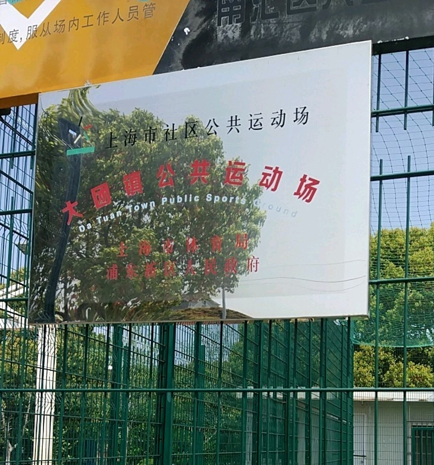
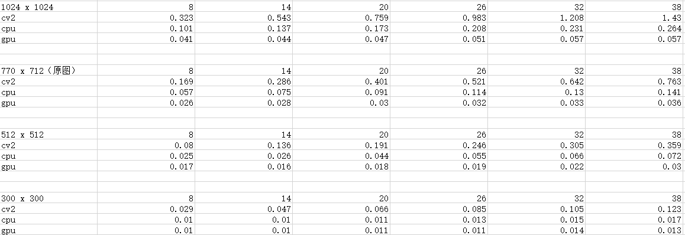

# TPS_Python

基于Pyorch的Thin plate splines实现。

## 介绍
由于cv2中的Thin plate splines函数比较慢且常用，于是用pytorch来实现一下的tps达到加速的目的。

## 环境
- python 3
- torch >= 0.4.0
- torchvision
- opencv
- numpy

## 代码结构
```
├── TPS_Person    # 使用pytorch实现的tps对人像图片做处理
└── TPS_Text      # 使用pytorch实现的tps对扭曲文字做处理 
```

## 效果

1. 人像图片


2. 文字图片




## 不同版本tps的耗时对比




